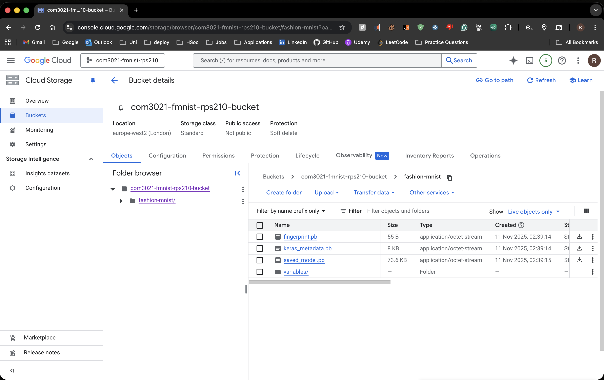
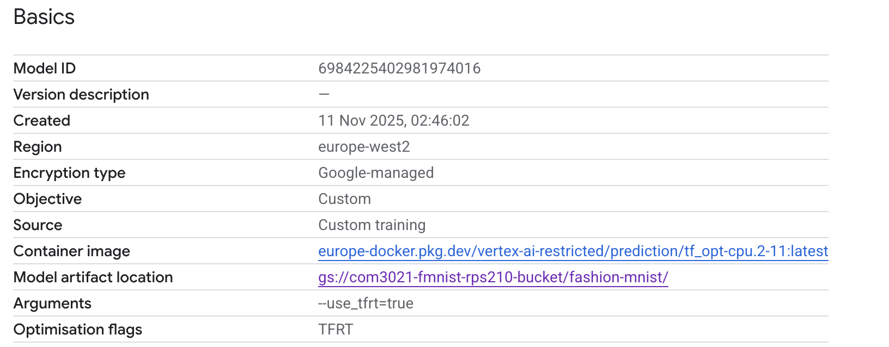
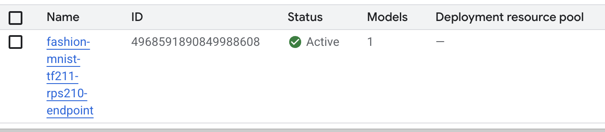
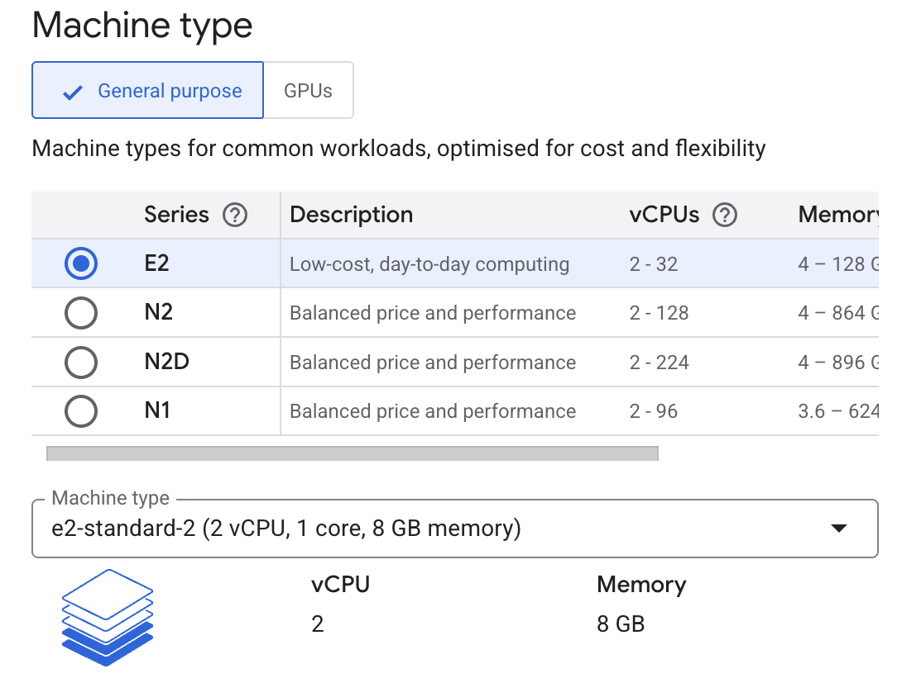
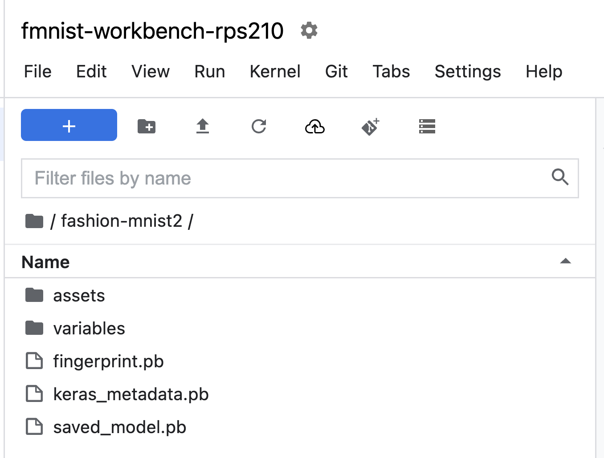
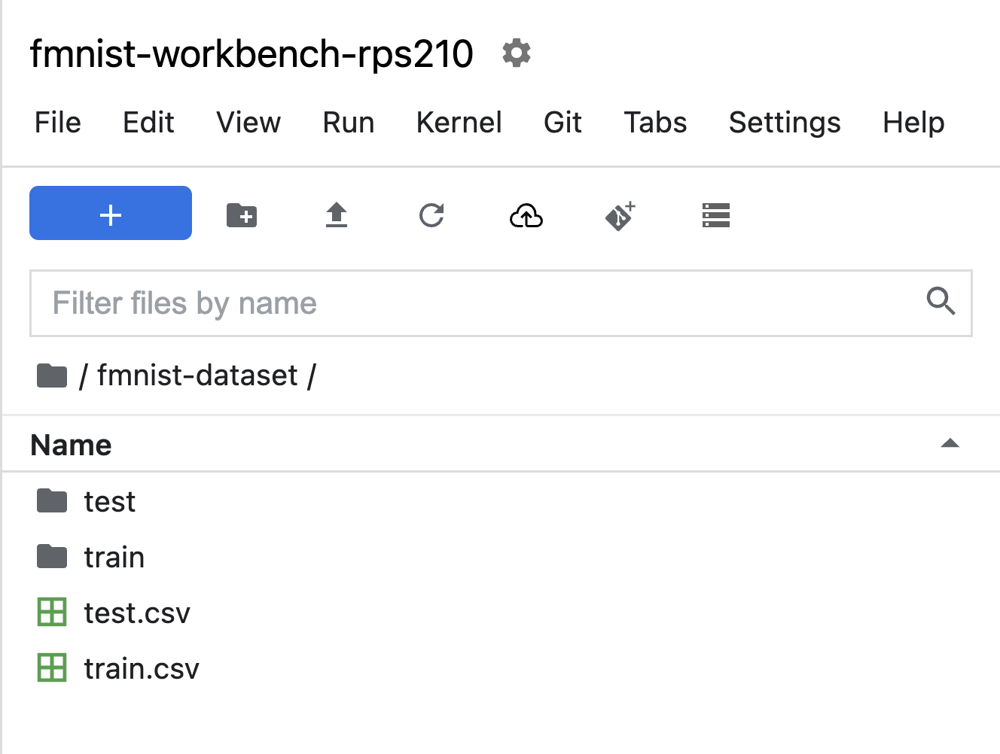

# Fashion-MNIST Model Deployment and Evaluation on Google Cloud Vertex AI

## Overview

This project explores the deployment, evaluation, and comparison of machine learning models using Google Cloud Vertex AI, TensorFlow, and the Fashion-MNIST dataset.

The work focuses on deploying a TensorFlow SavedModel to Google Cloud, configuring cloud-hosted prediction endpoints, performing remote inference, and comparing model performance against locally executed models and a custom Convolutional Neural Network (CNN).

The project was completed as part of **COM3021 – Data Science at Scale** during the final year of the BSc Computer Science programme at the University of Exeter.

---

## Project Objectives

The primary objectives of this project were to:

* Deploy a TensorFlow model using Google Cloud Vertex AI
* Configure cloud-based model serving infrastructure
* Perform inference through Vertex AI prediction endpoints
* Compare cloud-hosted and locally executed model performance
* Develop and evaluate a custom Convolutional Neural Network (CNN)
* Investigate practical machine learning deployment workflows on Google Cloud Platform

---

## Technologies Used

* Python
* TensorFlow
* Google Cloud Platform (GCP)
* Vertex AI
* Google Cloud Storage
* NumPy
* Pandas
* Jupyter Notebook

---

## Solution Architecture

```text
Fashion-MNIST Dataset
          │
          ▼
 TensorFlow SavedModel
          │
          ▼
 Google Cloud Storage
          │
          ▼
 Vertex AI Model Registry
          │
          ▼
 Vertex AI Endpoint
          │
          ▼
 Cloud-Hosted Predictions
```

---

## Project Workflow

### 1. Cloud Storage Configuration

The TensorFlow SavedModel artefacts were uploaded to Google Cloud Storage and organised for deployment through Vertex AI.



---

### 2. Vertex AI Model Registry

The model was imported into Vertex AI Model Registry, allowing versioned model management and deployment configuration.



---

### 3. Endpoint Deployment

The registered model was successfully deployed to a Vertex AI prediction endpoint, enabling cloud-hosted inference.



---

### 4. Vertex AI Workbench Environment

A dedicated Vertex AI Workbench instance was used for experimentation, model evaluation, and endpoint interaction.



---

### 5. Model Artefacts

The deployed TensorFlow SavedModel contained the standard TensorFlow model structure, including metadata, variables, and model configuration files.



---

### 6. Dataset Organisation

Training and testing datasets were structured for model evaluation and experimentation using the Fashion-MNIST image classification dataset.



---

## Models Evaluated

Three different approaches were evaluated throughout the project:

| Model                       | Purpose                   |
| --------------------------- | ------------------------- |
| Vertex AI Deployed Model    | Cloud-hosted inference    |
| Local TensorFlow SavedModel | Local execution benchmark |
| Custom CNN                  | Performance optimisation  |

---

## Results

| Model                       | Test Accuracy |
| --------------------------- | ------------- |
| Custom CNN                  | 91.97%        |
| Local TensorFlow SavedModel | 88.03%        |
| Vertex AI Deployed Model    | 87.79%        |

The custom CNN achieved the strongest classification performance on the Fashion-MNIST test set, outperforming both the provided TensorFlow SavedModel and the cloud-deployed Vertex AI endpoint.

The Vertex AI deployment achieved performance comparable to the locally executed TensorFlow model while demonstrating cloud-based model serving capabilities.

---

## Key Features

* Google Cloud Storage integration
* Vertex AI Model Registry configuration
* Vertex AI endpoint deployment
* Cloud-hosted model inference
* TensorFlow model evaluation
* Custom CNN development and training
* Fashion-MNIST image classification
* Comparative model performance analysis

---

## Skills Demonstrated

* Machine Learning
* Deep Learning
* Computer Vision
* Cloud Computing
* Model Deployment
* TensorFlow
* Google Cloud Platform (GCP)
* Vertex AI
* Data Processing
* Model Evaluation

---

## Repository Structure

```text
.
├── screenshots/
│   ├── bucket.png
│   ├── dataset-directory.png
│   ├── endpoint.png
│   ├── model-directory.png
│   ├── model-registry.png
│   └── workbench-machine.png
│
├── vertex_ai_ml_pipeline.ipynb
└── README.md
```

---

## Academic Context

Developed as coursework for **COM3021 – Data Science at Scale** at the University of Exeter.

The project investigates practical machine learning deployment workflows using Google Cloud Vertex AI and evaluates model performance across cloud-hosted and locally executed environments.
